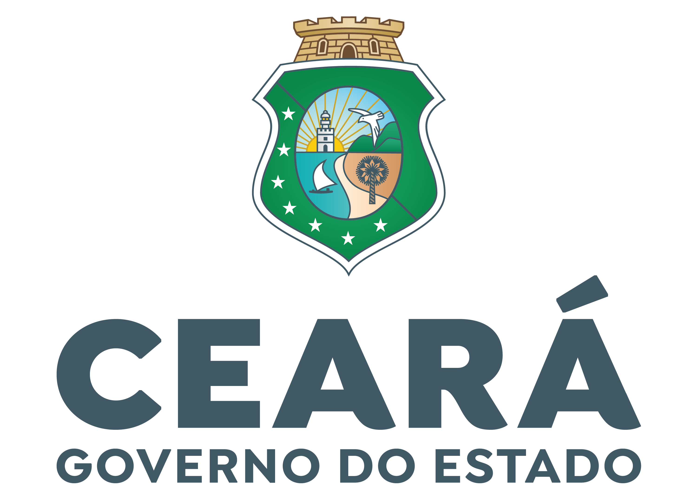

# Landing Page Geração Tech

  

Atividade 1

Esse repositório é uma atividade do curso [Geração Tech](https://geracaotech.iel-ce.org.br/) 
Um projeto do [Instituto Euvaldo Lodi](https://www.ielbahia.com.br/) (IEL) e o [Governo do Estado do Ceará](https://www.ceara.gov.br/) por meio da [Agência de Desenvolvimento do Estado do Ceará](https://www.adece.ce.gov.br/) (ADECE) para capacitação de jovens na área da tecnologia. 

A iniciativa tem o objetivo de oferecer Formação em Desenvolvimento Web.

## Objetivo
O objetivo dessa atividade é praticar e por a prova os conhecimentos adquiridos em aula sobre ***HTML*** e ***CSS*** replicando esse layout:

## Requisitos
Uso apenas de ***HTML*** e ***CSS***. 
O uso de outras tecnológias são restritas.